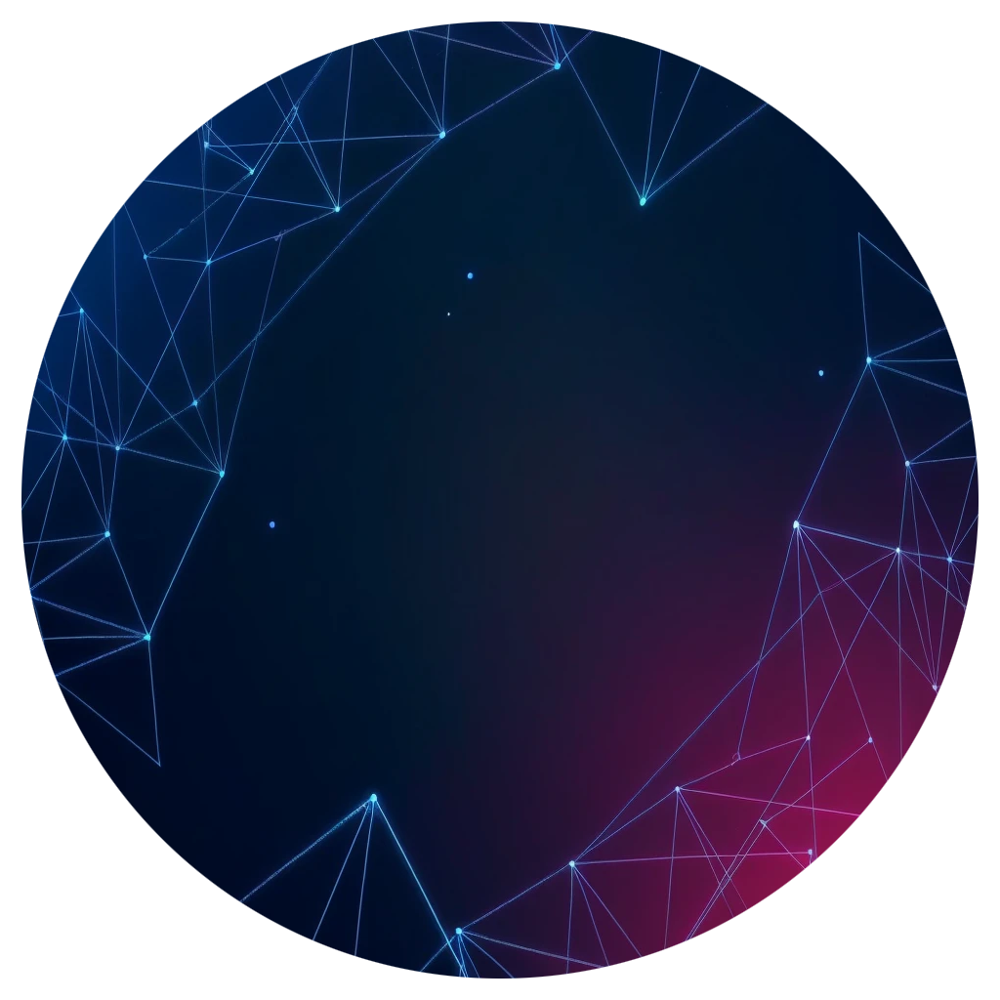

# DevXP 🚀

  

## Introdução

  

Bem-vindo ao **DevXP**, um projeto desenvolvido durante a imersão **Alura + Google GEMINI**! O devXP tem como objetivo centralizar e redirecionar desenvolvedores para cursos e documentações importantes para o estudo e aperfeiçoamento de suas habilidades. A interface foi projetada pensando em uma experiência de usuário suave e intuitiva, utilizando tecnologias modernas e uma estética visual cativante.

  

---

  



  

> "O que você tá afim de aprender, Dev?"

  

---

  

## Tecnologias Utilizadas 🛠️

  

-  **HTML5**: Para a estruturação semântica das páginas.

-  **CSS3**: Design responsivo e estilização (veja o [style.css](css/style.css) para detalhes).

-  **JavaScript (ES6)**: Implementação da lógica de busca e exibição dos cursos ([dados.js](js/dados.js)).

-  **Google GEMINI IA**: Utilizada para a geração de sugestões de cursos, dados inteligentes e também para tirar dúvidas durante o desenvolvimento do projeto.

-  **Photoshop & SonyVegas**: Edição de imagens e criação de vídeos usados no background e logotipos, editados manualmente para encaixar na estética do projeto.

-  **IA para criação de imagens**: Criação de assets visuais como background e ícones.

  

## Funcionalidades Principais 🌟

  

-  **Busca Inteligente de Cursos**: Digite o que deseja aprender e encontre cursos de plataformas renomadas.

-  **Resultado Filtrado e Organizado**: Exibe cursos com base no nível de aprendizado, tags e se são pagos ou gratuitos.

-  **Design Responsivo**: Adaptado para diferentes tamanhos de tela (desktop, tablet e mobile).

-  **Animações e Interatividade**: Melhor experiência visual e navegação com efeitos modernos.

## Estrutura do Projeto 🏗️

```bash
devXP/ 
├── assets/ 
│  ├── images/
│  │  ├── github-logo.png
│  │  ├── linkedin-logo.png 
│  │  └── Logo.png 
│  └── videos/ 
│  │  └── BackgroundAnimated.mp4 
├── css/
│  └── style.css 
├── js/ 
│  ├── App.js 
│  └── dados.js 
└── index.html
```

## Como Rodar o Projeto 💻

  

### Clone o repositório:

```bash
git clone https://github.com/IranSS/devXP.git
````
  

## Abra o arquivo index.html no seu navegador:

  

Basta abrir o arquivo diretamente no navegador para visualizar o projeto em funcionamento.

  

## Visualizações do Projeto

  

*  **Página Inicial:**

A página inicial oferece uma interface amigável, onde o usuário pode navegar pelos principais tópicos e iniciar a busca por cursos e documentações de forma intuitiva.

*  **Resultados da Busca:**

Os resultados da busca são apresentados de maneira organizada, facilitando a navegação pelos cursos recomendados e documentações disponíveis.

## Créditos ‍

Este projeto foi desenvolvido por **Francisco Iranildo de Sousa Avelino**, com a colaboração de:

* **IA de criação de imagens:** para a geração de artes e ilustrações.
* **Photoshop:** para o refinamento das imagens.
* **Sony Vegas:** Edição de vídeo (Background da página).
* **Google GEMINI IA:** para otimizar a busca por cursos.

Toda a estrutura e design visual foram feitos com cuidado para oferecer a melhor experiência aos desenvolvedores.